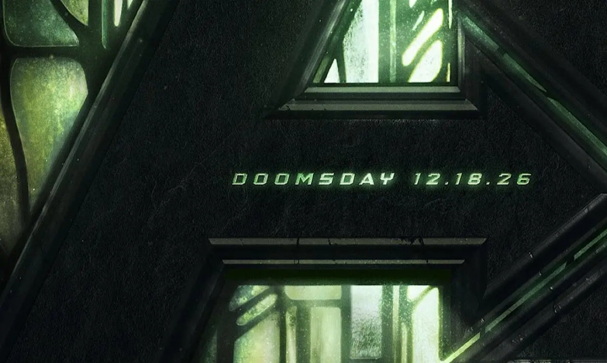

# 🎬 ROAD TO DOOMSDAY — Marvel Multiverse Watchlist

An interactive, pitch-black cinematic watchlist application for tracking your journey through the entire Marvel Multiverse leading up to **Avengers: Doomsday** (December 18, 2026).



---

## ✨ Features

- **⚡ Transparent Doomsday Logo Banner**: Custom metallic green **Avengers: Doomsday** header logo with a neon drop-shadow glow aura.
- **⏳ Live 5-Unit Countdown Timer**: Dynamic real-time countdown to December 18, 2026 (**`MONTHS : DAYS : HOURS : MINUTES : SECONDS`**).
- **🔊 Ambient Clock Ticking Sound**: Ticking clock sound effect enabled by default with interactive Sound ON/OFF controls.
- **🖼️ Full-Screen Doomsday Background**: Fixed, responsive metallic-green Doomsday background artwork with dark gradient overlay.
- **🎯 105 Complete Marvel Multiverse Titles (Recommended Sequence)**:
  - 1 – 23: MCU — Infinity Saga
  - 24 – 38: MCU — Multiverse Saga
  - 39 – 52: MCU — Important Supporting Stories
  - 53 – 64: 🧬 X-Men / Fox Universe
  - 65 – 67: 🧪 Fantastic Four — Other Universes
  - 68 – 74: 🕷️ Spider-Man Universes
  - 75 – 80: 🕸️ Sony Spider-Man Universe
  - 81 – 93: 📺 Marvel Television / Defenders
  - 94 – 105: 🎨 Animated & Other Universes
- **🏷️ Importance Level Badges**:
  - 🔴 **ESSENTIAL**: Directly useful for understanding Doomsday
  - 🟡 **IMPORTANT**: Strongly connected to characters/universes
  - ⚪ **OPTIONAL**: Helps understand wider Marvel universes
- **🔎 Universal Streaming & Trailer Guide**: Direct 1-click links to YouTube official trailers and Google "Where to Watch" search.
- **🚀 Dynamic Progress & Journey Milestones**: Track your progress with animated nodes (`Started` ➔ `Progress` ➔ `Multiverse Unlocked` ➔ `X-Men Done` ➔ `Spider-Verse Done` ➔ `DOOMSDAY READY`).
- **💾 Automatic Browser Saving**: Watch state is automatically saved in browser `localStorage`.
- **📱 Fully Responsive Design**: Mobile-adaptive countdown layout, responsive card grids, and touch-optimized controls.

---

## 🚀 Quick Start

Open `index.html` in any modern web browser, or run locally via Python:

```bash
python -m http.server 8080
```

Then visit `http://localhost:8080` in your browser.
